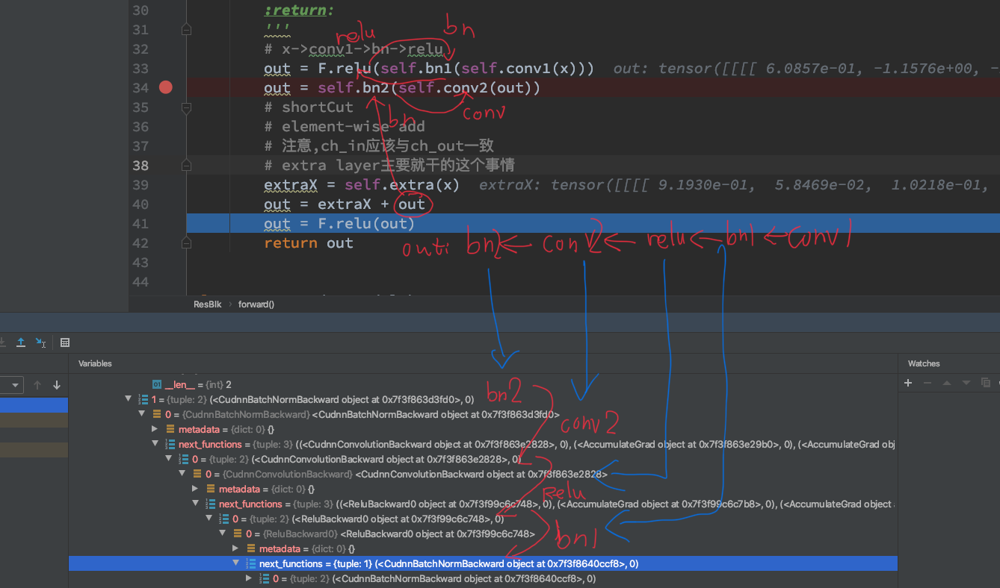

## 第十章 ResNet 
### Chap10-1 CIFAR-10
- 一共十类物体
- 32\*32 6000张\*10

### 相关待解决疑惑
- 网络中间隔了一层自己的flatten为啥梯度还能回传
    - 好像是那个grad_fn里边存了他三生三世的来源,如下边那个图
- 那个dataloader返回了什么?
    - 他那个Random是每个epoch返回不一样的吗?
    - 看了一下每个epoch确实是吃了60000张图,epoch本身并没有变大
- optimizer里边记录的梯度会随着一个个batch进行累加,那么我直接累加一个epoch岂不是最好的?
    - 实验了下短epoch内,效果没有一个epoch更新一次好
    - 另外仿佛不用改lr,他的梯度derta理论上应该直接是原来的n倍了

### Chap10-2 ResNet
- 感觉那个每一个nn.Module出来的小朋友好像都会记录上一层和自己的关系
- 仔细瞅了一眼,好像tensor会自己把之前自己怎么过来的记得清清楚楚,方便反向传播
- 
- F.adaptive_avg_pool2d(x, \[1, 1\]) 强行pool到目标大小
    - 不是插值,他就是单纯的取整