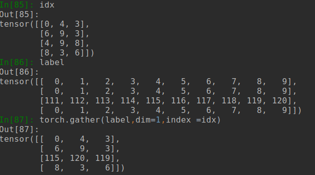

## 第五章 数据类型II 
### Chap5-1 Broadcast 广播
- 中心思想:一个[32,3,28,28]的大矩阵，每个上边都想加点东西
    - 比如一个batch的feature map每个像素都想加5
    - 为了写着方便，也为了节省内存，直接加就行
    - 加的过程：
        - 约定右边为小维度，然后从右向左加
        - A[32,3,28,28] B[1]
        - B(unsqueeze)->[1,1,1,1]\(expand)->[32,3,28,28]
        - 右边反正一定要匹配上，要么一样，要么为1
        - 如果比如想对第二个维度搞事情，那么手动在后边几个维度进行加值
        - B[3]\(手动unsqueeze)->[3,1,1] -> A+B
        
### Chap5-2 Concat 拼接与拆分
- 设A[32,8],B[32,8],C[32,9]
- cat concat
    - 拼接，torch.cat([a,b],dim=3)
    - 在第三个维度(从左至右算)进行叠豆腐
    - 要求拼接dim以外所有维度大小一致
    - torch.cat([a,b],dim=0)为[64,8]
- stack
    - 也是拼接，但是是升维度的拼接
    - torch.stack([a,b],dim=3)
    - 新生的维度是第三个维度
    - 要求所有维度一模一样
    - torch.stack([a,b],dim=0)为[2,32,8]
- split 用长度进行拆分(每个有多长)
    - xx,yy,zz = c.split([3,3,3],dim=1)
    - 生成三个[32,3]的被拆的
    - 等价于c.split(3,dim=1)
- chunk 用个数进行拆分(拆几个出来)
    - xx,yy = c.chunk(2,dim=0)
    - 生成了俩[16,9]的

### Chap5-3 数学运算
- 直接的运算
    - 基本就是加减乘除，会有broadcast
    - 基本都是element-wised的
- 矩阵的乘法
    - a*b 每个元素分别乘，类似点积
    - mm,适合2维矩阵相乘
    - matmul,自动乘后两维，前边的要求符合broadcast条件
    - matmul和@是一个意思
    - torch.mm(a,a) 或者 a.mm(a)
- 转置
    - 一般torch里边写矩阵喜欢(out,in)顺序写
    - 所以乘法的适合最好做个转置
    - .t是转置，但是只能给2维用，其他时候transpose吧
- 指数运算
    - **,pow一样n次方
    - exp 每个元素进行exp运算
    - log 一样，不过是对e取底
- 近似计算
    - a.floor() 下取整
    - a.ceil()  上取整
    - a.trunc() 取整数部分(当全是正数的时候和floor一样，但是负了就不一样了)
    - a.frac() 全取小数部分
    - a.round() 四舍五入到整数
- 裁剪运算
    - a.clamp(min,max)
    - 大于max的变成max
    - 小于min的变成min
    - 常用于对grad的裁剪
    
### Chap5-4 统计属性
- 范数 norm(不是normalize/归一化)
    - vector norm和matrix norm在一维的情况下有一些区别
        - vector norm就是绝对值求和
        - matrix是取最大的那一行的绝对值求和
        - 用的应该是vector的
    - a.norm(1) 计算第一维度的norm，注意，计算第几维度，那个维度会被消掉
        - a[4,10]
        - a.norm(1) 结果[4]
- mean,sum,min,max,prod
    - 均值，求和，最小最大，叠乘
    - 不写的话是全局，写的话是对某个维度进行统计运算
- argmin,argmax
    - 得到最大或最小的元素对应的索引
    - 默认应该是给的是存储顺序的
- dim,keepdim
    - 指定计算上述内容的维度
    - 写哪个维度哪个维度就消失
    - keepdim默认为false，为true的时候，就不进行降维
        - [32,3]->[3],如果是true,就是[32,3]->[32,1]
    - 对于min,max来说，如果指定了dim,会返回argmax
- topk(3,dim=1,largest=True)
    - 最大的k个，需要指定dim
    - 为真的话，是最大的，反之是最小的
- kthvalue(8,dim=1)
    - dim1下，第8小的数
- 比较运算符 >=...
    - 逐元素比较，返回0,1的矩阵
    - torch.eq(a,b) <=> a==b
    - torch.equal(a,b) 只会返回true，false 完全一致返回true
    
### Chap5-5 高级运算
- 这些运算主要是进行批处理的运算，这样好用gpu，防止写for太慢
- where(condition,a,b),符合condition的，选取a的，否则选取b的
- gather(input,dim,index)
    - input为label矩阵，上边是待采集的映射表
    - dim表示从哪个维度进行采集
    - index是那个维度的序号
    - label在拥有dim维度的个数，应该和label内部的个数一致
    - label每行用index进行采样
    - 