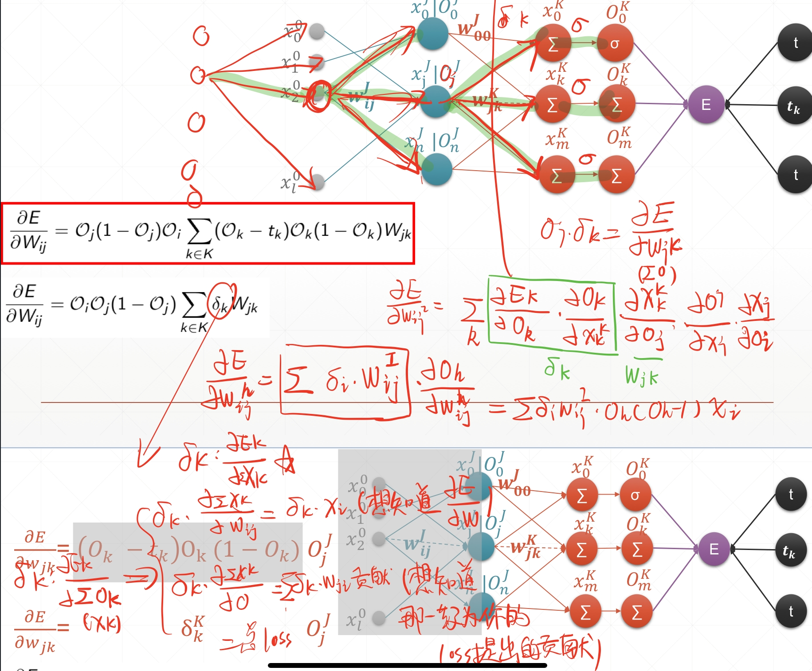

## 第六章 随机梯度下降 
### Chap6-1 梯度
- 导数，标量，形容变化趋势
- 偏微分，标量，可以理解为在正x方向，正y方向的变化趋势
- 梯度，向量，一堆偏微分的组合
    - 可以证明，梯度的方向是(向正方向增加)变化率最快的方向
    - 梯度的模值是变化率的最大值
- 梯度下降
    - 因而梯度下降就是让参数按照梯度的方向进行反方向走
    - 每个参数按照其偏微分的反方向的比例进行调整
- 容易跑到的错误的位置
    - 局部极小值
    - 马鞍点(某个方向的最大值,导致梯度为0,还跑不出去)
- 解决方向
    - 参数初始化的位置
    - lr 大了容易炸，小了容易局部最小值而且训得慢
    - 动量 调整的方向还参考上一步的调整逻辑

### Chap6-2 常见梯度函数
- 就是各种求偏导数
- 但有个小小纠结的地方，就是很多式子是带着xy的，但是求得时候并不会对xy进行考虑
- 这样的物理意义在于视xy为常数，或者x，y不变的情况下找优化
- 感觉可能是寄希望于对于整个数据集，x，y基本不变吧

### Chap6-3 激活函数以及其梯度
- 灵感来源于青蛙的神经结构
    - 上一群神经元输出加权求和，如果大于阈值，1，小于阈值0
    - 但是那种结构无法求导
- sigmoid函数
    - 1/(1+e^-x)
    - 值域(0,1)
    - 优点，连续好求导，导数为a(1-a)，便于利用前向结果
    - 缺点，输入超级大超级小的时候导数很小容易出问题
    - torch.sigmoid(x)
- tanh函数
    - RNN常用
    - 2sigmoid(2x)-1
    - 值域(-1,1)
    - 导数1-a^2
    - torch.tanh(x)
- Relu
    - 小于0为0，大于0为x
    - 好求导，常用，不容易梯度爆炸或者消失
    - torch.relu(x)

### Chap6-4 常见的loss以及其梯度
- MSE 均方误差
    - MSE与二范数的区别:差一个平方
    - 要求的话可以loss=norm(y-pred,2).pow(2)
    - 也可以是F.mse_loss(xxx,xx)
    - F.mse_loss(a,b)
- Cross Entropy 交叉熵损失
    - 其他章节会讲，用于多分类的损失
    - 会结合softmax一起使用
- softmax
    - exp(ai)/Σ(exp(ak))
    - 对aj求导以后是pi(x-pj) x=1 if i==j else 0
    - 前向运算的时候很多值可以利用到
    - p = F.softmax(a,dim=0)
- 代码里的一些内容
    - 需要求梯度的tensor声明的时候requires_grad=True
    - 或者在后边补xxx.requires_grad_()
    - torch.autograd.grad(loss表达式，[求梯度的参数表])，返回对应的梯度
    - 或者是loss.backward(retain_graph=False)
        - 此时每个参数都可以去w.grad,grad会被赋值到属性中
        - backward一次以后就不能第二次了，会被清除
        - 想多次玩的话可以设置RG为True
    - 另外求loss的时候loss必须是一个标量，或者只有一个元素那种才可以
    
### Chap6-5 单层单一输出感知机
- 激活函数采用的sigmoid
- 当时算sigmoid的导数主要是为了把它当成中间步骤进行运算
- 最后解出来Wj仅与他对应的x有关，以及Output和label

### Chap6-6 多输出感知机
- 推导的时候可以试着把图画出来，看每一个要求的参数影响了哪些内容，这样求Σ的时候，可以很容易化简
- 多输出的感知机Wjk与对应的x有关，也与Output的第k项的label有关
- 如果out那里采用了softmax以及crossEntropy的话，可能会复杂一些
    - 如果后便没有推导的话，可以试一试自己推一推

### Chap6-7 链式法则
- 就是学到的链式法则，没啥新的内容

### Chap6-8 反向传播
- 主要应用了链式法则
- 一个loss由上一层的多个分支的loss组合而来
- derta-jJ的定义
    - 在J层的第j个节点，Loss对于上一层的Σx的导数
    - derta\*Oj-> = derta\*dΣx/dW =>Loss在某一层的对W的求导
    - derta\*Wij-> = derta\*dΣx/dx =>j节点的Loss由上一层的某个节点引发的错误
    - 对这些错误求和，在翻越一个sigmoid,可以得到再向前一层的loss
    - dertaJj = Oj*(1-Oj)\*ΣW\*dertaWj -> 本级的loss是之后层数的loss的求和
    - 
### Chap6-9 Himmelblau Function
- 一般用于检测优化器的效果，有四个极小值点
- 不同的初始化可以造成不同的优化结果

### Chap6-10 补充课程，Numpy实现MLP
- 和原来的实现有些许不太一样
- 不过存在两个疑惑
    - 如果想引入softmax+交叉熵，反传要怎么改(看完下一章回来瞅瞅)

### Chap6-11 自己撸了一个batchSize版本的MLP
- 将输入从[784,1]扩充到[784,bs]以后，直接影响的是derta矩阵和每一层的out
- out和derta矩阵会从[out,1]变到[out,bs]，彼此不会产生影响
- 进行迭代运算的时候，derta仅仅取决于当前的W，以及Out
- nabla的值按照矩阵相乘[outsize,batchsize]@[batchsize,inputsize]，会变成对batch中每一个元素的偏导数进行求和运算，正好符合batch的定义
    - 注意bias的偏导，也要乘以[batchsize,1]\(对于每个input而言，bias唯一)
- 前向也可以进行batch运算
- 因而直接拓展input的形状即可
- 速度大概在bs=25的时候，提升了4-5倍
- 注意不能直接融合input和output，因为中间存在非线性层