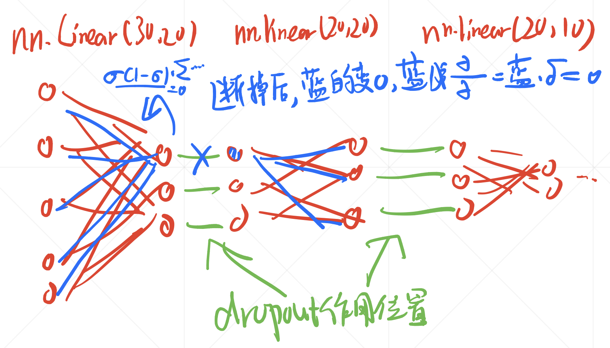

## 第八章 过拟合 
### Chap8-1 过拟合和欠拟合
- 很多时候我们预测的时候都是已知模型估计参数
- 但是神经网络搞事情的时候不行，因为你不知道模型
- 表达能力取决于搜索空间，与参数量正相关
- 如果表达能力太差，容易欠拟合
- 如果表达能力太好，且数据集很少，由于噪音，容易把噪音给拟合，过拟合
- 欠拟合：val train都很差
- 过拟合：val很差 train很好(泛化能力差)

### Chap8-2 Train Valid Test
- 就是验证集自己用来找好的模型，测试集是模拟真实环境的
- 一般情况下，每个epoch输出的效果应该是在val上的
- k-fold cross-validation 每个epoch找一小波当val

### Chap8-3 Regularization and Weight Decay
- **weight decay不是学习率的衰减(之前一直理解错了)**
- 防止过拟合的方法最简单粗暴的是更多的数据集
- 但是一般是没有的
- 另外就是不要找太深的网络
- 或者用Regularization，正则化权值
- 因为一般过拟合都是有一堆高频分量带着大的权值
- 防止这种过分表达，可以让weights尽量少一些
- 所以将Weight的范数加到loss里就可以
    - L' = L + lbd*权值范数
- 有一范数和二范数，pytorch自带二范数
- optimizer = optim.SGD(xxx, weight_decay=0.01)
- 感觉lbd越大，惩罚更严重，一般取的不是很大

### Chap8-4 动量与学习率衰减
- momentum，动量，一个类似于惯性的思想
- Z(k+1) = bZk + derta(Wk)
- w(k+1) = Wk - a*Z(k+1)
- 大概就是每次衰减的方向是本次的W负梯度方向与上次的总方向的加权求和
- 主要防止来回蹦跶
- 而且当当前的梯度为0的时候，还能再续一下，往前跑一丢丢，冲最后一下
- 仿佛只有SGD用设置动量，Adam等其他的优化器好像已经把动量融合进去了？
- 学习率衰减一般有两种方案
    - 看连续多少epoch的loss不咋变化，就减少学习率
    - 固定epoch减少学习率(用的会多一些)
    
### Chap8-5 Early Stop And Dropout
- Early Stop就是一直看validation set，valid的loss处于低谷的时候，断掉
- Dropout，层与层之间随机断掉连接(某些值突然为0，这样好像他的梯度也没了)
- 减少参数，防止训练到过拟合
- 
- dropout指的是蓝色叉子概率性发生
- 个人感觉蓝线中的梯度会消失，有空查一下
- 一般在eval的时候，要把所有连接改回去
- 在nn.Linear之间，设置这玩意，不过tf和pt的定义不一样，一个是丢弃的概率，一个是不丢的
- SGD:指的是一个epoch随机取一个batch进行训练

