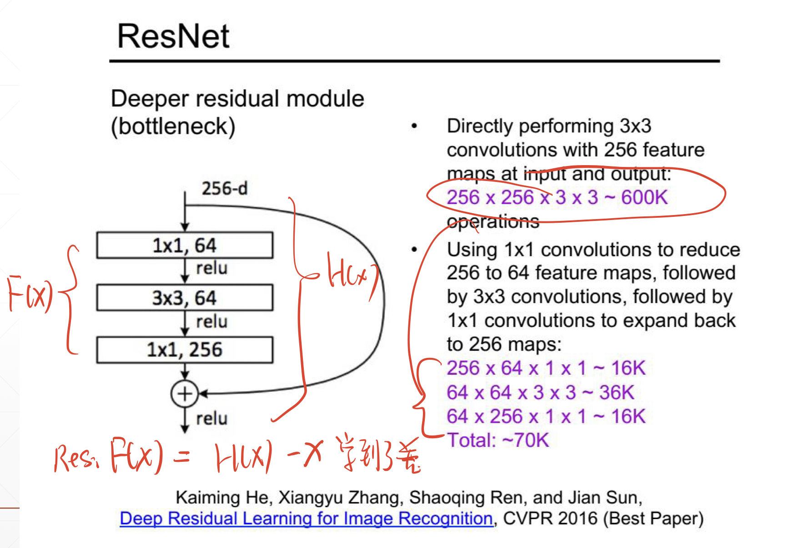

## 第九章 卷积神经网络 
### Chap9-1 什么是卷积 
- 共享权重:本层所有的输出共享一套卷积核权重
- 原来的FNN实际上所有的输出都是有自己的权重，而且自己与所有的输入都相连
- CNN每个点只与一部分的输入相连，称为感受野
- 卷积我觉得他说的不透彻，反正就是魔改的信号的那个，反卷积的感觉

### Chap9-2 卷积神经网络
- 每一层的数据存储格式:[batchSize,channel,w,h]
- layer初始化: layer = nn.Conv2d(in_c,o_c,kernel_size,stride,padding)
    - 每一层的权重存储格式:[out_c,in_c,w,h]
    - 每一层偏重:[out_c]\(有几个filter)
    - 注意:初始化的时候,先in,但他存的时候是先out的
- 卷积用法有
    - layer.forward(已经有layer的)
    - F.conv2d(x,w,b,stride,padding)(自己撸layer的)
- 推荐用法out = layer(in) (这个方法会顺手把一些其他的事情给办妥)

### Chap9-3 上采样和下采样
- pooling的时候有一个stride,一般来说stride和下采样的框框一样大的时候,才是我们传统意义的下采样
- pooling相当于考虑了每一个结果进行下采样
- conv直接有stride的话可以生成一样大小的feature map,但有一部分的信息是完全丢失的
    - 等价于隔行采样
- polling
    - layer = nn.MaxPool2d(2,stride=2)
- 上采样
    - out = F.interpolate(x, scale_factor, mode)
- Relu
    - 也是逐元素做的,注意layer = nn.ReLU(inplace=True),代表原地更改,少一半内存

### Chap9-4 批量归一化BN层
- 批量归一化感觉一般是用在激活函数之前
- 但是因为卷积本身就是线性运算,所以感觉放激活函数前的哪里都木的问题
- 主要是防止一个100,一个1,100的变了1%与1的变了100%可能会产生类似的loss(比如relu)
- 有Image Normalization,图片扔进来之前RGB分别做归一化
- Batch Norm指的是,一个Batch里,所有的通道,分别做归一化
- 归一化以后可能会乘以系数+一个偏置,而这而这本身也是可以学习的
    - 映射到N(W,B)的那种感觉
- 他们内置会存一个running_mean和一个running_var,这俩是全部数据的输入的均值和方差
- 这俩值不会立即更新,好像会有momentum之类的影响他们的增长
    - momentum的规则是0.9\*last+0.1\*本次的
- 在train模式下,这俩会去根据送进来的batch算均值,方差然后归一
- layer.eval()进入test模式
- 在test模式下,会用这俩值去归一化送进来的某一个数据
- 一些其他参数
    - affine 是否应用weights和bias
    - momentum 动量
    - eps 归一的时候,分母不止有std,还有eps
    
### Chap9-5 经典的卷积神经网络
- LeNet-5 
    - 80年代手写数字识别的网络
    - 在DSP上运行的
    - 3层卷积2层全连接
    - 下采样用的隔行采样
    - 99.2%数字准确率
- AlexNet
    - ImageNet2012冠军
    - 两块GTX580,分开卷积核训得
    - 下采样用的maxPooling
    - 开始使用了ReLU以及dropout
    - 11*11卷积核
- VGG
    - 有很多种,引入了很多小卷积核代替大的
    - 3*3 1*1
    - 注意,他的计算量比ResNet还大
- GoogLeNet
    - 2014ImageNet冠军
    - 采用了多种卷积核卷积,然后concat的做法
- 发现了深点好,但是在22层上下就上不去了,直到引入了ResNet

### Chap9-6 ResNet
- 为了防止层数太多,引入了残差块
- 大概就是几层组成一个残差块
- 残差的名字是由于中间那一坨学到了一个F(x)-x
- 
- 这东西可以加深网络,而且(感觉)理论上可以把最后一层直接传到最开始一层
    - 但是有ReLU可能会去掉一些
- 甚至,他的参数量还少了很多
- 另外,VGG19参数量大于RESNET101,注意一下
- DenseNet 疯狂串联,然后concat
- 据说最后会根据concat的结果进行channel的选择,模拟随机短路一些连接

### Chap9-7 nn.Module模块
- 这个模块是很多卷积层的父类
- 一些BN层,卷积层或者全连接层他都有预设
    - nn.Linear
    - nn.BatchNorm2d
    - nn.Conv2d
- 支持多个他的儿子们组成nn.Sequential()
    - 这里边是一堆nn.Module对象,就能自动正传反传
    - 会自动记录参数(按照层数/Weights-Bias的顺序记录)
    - 默认自动记录梯度
    - optimizer写的时候可以自动用net.parameters()
- Modules
    - 好像可以直接把很多层聚合在一个单元
- to(device)
    - 调GPU用的
    - nn.Module组成的net可以直接.to,是对本身做变换
    - tensor的.to是做一个放在gpu上的,本身不变,返回值变的
- save,load
    - net.save(set.state_dict(),"xxx.mdl")
    - net.load_state_dict(torch.load("xxx.mdl"))
- train与test
    - dropout在test的时候不drop
    - BN在test的时候,采用running平均值而不是测试批次的
    - net.eval()激活测试模式
- 自己写类
    - 改init,改forward就行
    - init,自己写的w,b注意用nn.Parameter(tensor)定义
    - forward写怎么卷积就行
    - 这样之后sequential的时候它会自动去研究怎么用
    
### Chap9-8 数据增强
- 数据少的时候
    - 找个少点参数的网络
    - 正则化项,减少参数乱蹦
    - 数据增强
- 数据增强类型
    - 翻转,旋转,裁剪,GAN
- 一般就在datasets的transform参数加
- transforms.Compose([xxx,xxxx,transforms.ToTensor()])
    - RandomHorizontalFlip()
    - RandomVerticalFlip()
    - ...
    - 理论上每个图都会经历一下下随机变化,到时候看一下是不是每个Epoch都这么变一下
- shuffle = True
- 由于数据增强并没有太大的改变数据的分布,所以无限增强并不能带来无穷的增益